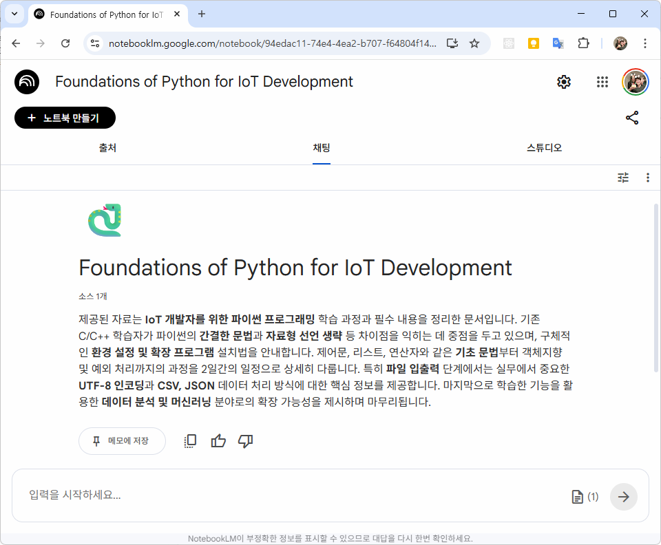
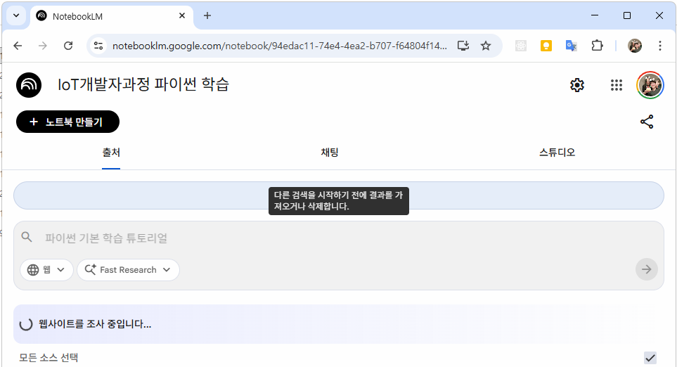
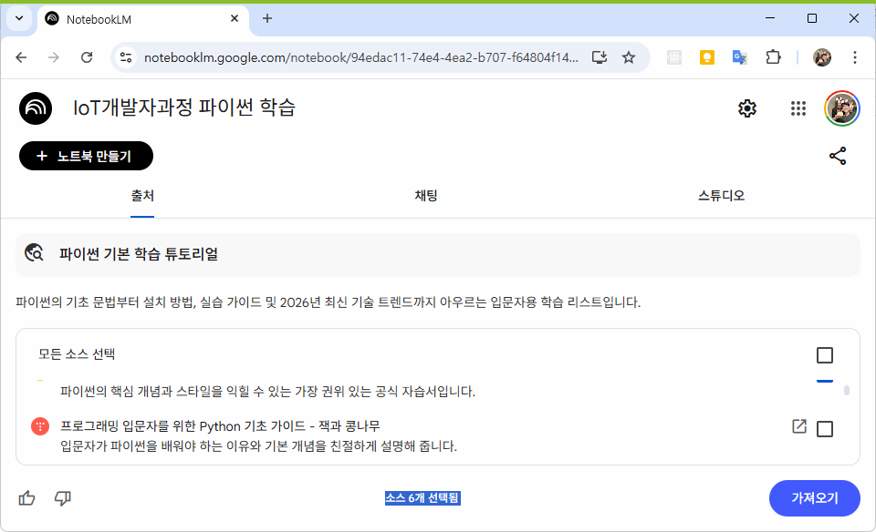

# iot-ai-utiliztion-2026
IoT 개발자과정 AI 활용법

## ChatGPT

## Gemini

## NotebookLM

- Google `Gemini기반`의 AI기반 노트 정리 솔루션
- 내가 필요한 자료만 가지고 공부를 도와주는 `개인 AI 비서`

### 자료 기반 요약정리
- PDF 등 문서나 웹 사이트 링크 입력
- 자동으로 핵심 요약

#### 질문에 대한 답변
- 일반 LLM은 모든 데이터 상에서 검색 후 답변
- 내가 필요한 자료, 내 자료 안에서만 답변

#### 자동 노트 생서
- 정리된 노트를 자동으로 만들어줌
- 개면, 예제, 요약 구조로 정리

### 사용분야

- 강의자료 정리
- 논문 요약
- 코딩문저 분석
- 시험대비

### 사용법

#### 시작

1. [NotebookLM](https://notebooklm.google.com/) 접속
2. 새로만들기 클릭
3. 필요한 웹사이트 링크나 자료 업로드

    
    
    - 압축파일 업로드 불가

    

4. 출처, 채팅, 스튜디오 탭
    - 출처에서 필요한 자료 업로드
    - 채팅에서 LLM 대화진행
    - 스튜디오에서 보고자료, 발표자료, 마인드맵 등 자료 생성

5. 출처에 웹사이트 검색

    - 필요 웹사이트 체크
    - 가져오기 클릭

    

6. 정리
    - 자료넣고,
    - 질문하고,
    - 요약/정리 자료 생성(스튜디오 활용)

7. 팁
    - 자료 많이 입력할 수록 성능 업
    - 질문 구체적으로
    - "~처럼 만들어줘" 스타일 프롬프트 적용성 좋음